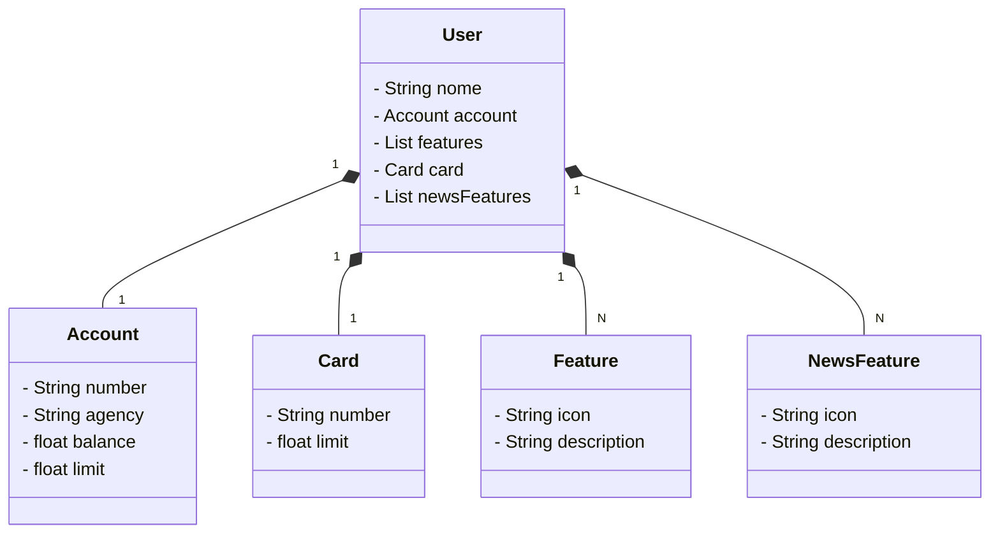

# Bootcamp Santander dev 2024
Java RESTful API criada no final do bootcamp santander dev backend java 2024.

## Diagrama de classes 

```mermaid
classDiagram
    class User {
        - String nome
        - Account account
        - List<Feature> features
        - Card card
        - List<NewsFeature> newsFeatures
    }
    class Account {
        - String number
        - String agency
        - float balance
        - float limit
    }
    class Card {
        - String number
        - float limit
    }
    class Feature {
        - String icon
        - String description
    }
    class NewsFeature {
        - String icon
        - String description
    }

    User "1" *-- "1" Account
    User "1" *-- "1" Card
    User "1" *-- "N" Feature
    User "1" *-- "N" NewsFeature
```
